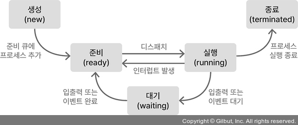

# 🤖 CPU 스케쥴링

## CPU 스케줄링이란?

CPU 스케줄링은 멀티태스킹 운영 체제에서 중요한 개념으로, **CPU가 여러 프로세스를 처리하는 순서를 결정하는 방식**이야.

**어떤 프로세스를 언제 실행시킬지 결정**하는 알고리즘을 공부해 볼거야.

그리고 우리가 공부할 알고리즘은 **프로세스들의 우선순위, 요구되는 자원** 등을 기반으로 CPU의 효율적인 사용을 목표로 한대.

### 언제 스케줄링이 발생할까?

1. 프로세스가 실행 상태에서 대기 상태로 전환될 때
2. 프로세스가 실행 상태에서 준비 상태로 전환될 때
3. 프로세스가 대기 상태에서 준비 상태로 전환될 때
4. 프로세스가 종료될 때

### 스케줄링 유형

1. 비선점형 스케쥴링
   - 프로세스가 CPU를 할당받으면 자발적으로 반납하거나 종료될 때까지 CPU를 독점
   - 구현이 간단하고 오버헤드가 적음
   - 응답 시간을 예측하기가 어려움
2. 선점형 스케쥴링
   - 운영체제가 강제로 CPU를 회수하여 다른 프로세스에게 할당해줄 수 있어
   - 응답 시간이 빠름
   - 컨텍스트 스위칭으로 인한 오버헤드 발생

## 프로세스 상태와 스케줄링 관계

프로세스는 생명 주기 동안 여러 상태를 가지며, 각 상태 전환 시점에서 스케줄링이 발생해



- 생성(new): 프로세스가 생성된 상태
- 준비(ready): CPU를 할당받기 위해 대기 중인 상태
- 실행(running): CPU를 할당받아 실행 중인 상태
- 대기(waiting/blocked): I/O 작업 등으로 CPU를 사용하지 않고 대기 중인 상태
- 종료(terminated): 실행이 완료된 상태

## CPU 스케줄링의 목표

1. **공정성 (Fairness)**: 모든 프로세스가 공평하게 CPU 자원을 얻을 수 있어야 한다.
2. **효율성 (Efficiency)**: CPU 자원을 최대한 효율적으로 사용해야 한다.
3. **응답 시간 최소화**: 대화형 시스템에서는 빠른 응답 시간이 중요하다.
4. **처리량(Throughput) 최대화**: 시스템 내에서 처리되는 프로세스의 수를 최대화해야 한다.
5. **대기 시간 최소화**: 각 프로세스가 대기하는 시간을 최소화해야 한다.

### 스케줄링 기준

위의 목표에 따라 스케줄링 알고리즘의 성능을 평가하는 기준은 아래와 같아.

1. CPU 이용률(CPU Utilization): CPU가 작업을 처리하는 비율 (높을수록 좋음)
2. 처리량(Throughput): 단위 시간당 완료되는 프로세스 수 (높을수록 좋음)
3. 반환 시간(Turnaround Time): 프로세스가 시작부터 종료까지 걸리는 총 시간 (낮을수록 좋음)
4. 대기 시간(Waiting Time): 프로세스가 준비 큐에서 대기하는 총 시간(낮을수록 좋음)
5. 응답 시간(Response Time): 요청 후 첫 응답이 나올 때까지의 시간 (낮을수록 좋음)

## CPU 스케줄링 알고리즘

- **1- FCFS (First-Come, First-Served)**

  가장 단순한 스케줄링 알고리즘으로, 프로세스가 도착한 순서대로 CPU를 할당해.

  - 예제

        | 프로세스 | 도착시간 | CPU 버스트 시간 |
        | --- | --- | --- |
        | P1 | 0 | 24 |
        | P2 | 1 | 3 |
        | P3 | 2 | 3 |
    
    간트차트
    
    ```
    0         24         27   30
    |----P1----|----P2----|P3-|
    ```
    
    분석:
    
    - P1 대기시간: 0
    - P2 대기시간: 24-1 = 23
    - P3 대기시간: 27-2 = 25
    - 평균 대기시간: (0+23+25)/3 = 16
    
  - 장점
      - 간단하고 구현이 쉬움
      - 공정한 방식
  - 단점
      - Convoy effect: 긴 프로세스가 먼저 실행된다면, 뒤에 있는 짧은 프로세스들의 대기 시간이 길어져 응답 시간이 늦어짐

- **2- SJF (Shortest Job First)**

  CPU 버스트 시간이 가장 짧은 프로세스에 먼저 CPU를 할당해

  1. 비선점형 SJF (Non-preemptive SJF)

     프로세스가 CPU를 할당받으면 해당 프로세스의 CPU 버스트가 완료될 때까지 CPU를 사용

     - 예제
        
     | 프로세스 | 도착시간 | CPU 버스트 시간 |
       | --- | --- | --- |
       | P1 | 0 | 7 |
       | P2 | 2 | 4 |
       | P3 | 4 | 1 |
       | P4 | 5 | 4 |
            
       간트차트
            
       ```
       0      7      11  12     16
       |--P1--|--P2--|P3|--P4--|
       ```
        
       분석:
        
       - P1 대기시간: 0
       - P2 대기시간: 7-2 = 5
       - P3 대기시간: 11-4 = 7
       - P4 대기시간: 12-5 = 7
       - 평균 대기시간: (0+5+7+7)/4 = 4.75
     
2. 선점형 SJF = SRTF (Shortest Remaining Time First)
        
    새로운 프로세스가 도착했을 때, 남은 CPU 버스트 시간이 현재 실행 중인 프로세스보다 짧으면 CPU를 선점한대
        
    - 예제 (위와 동일)

     | 프로세스 | 도착시간 | CPU 버스트 시간 |
     |------| --- | --- |
     |   P1 | 0 | 7 |
     | P2   | 2 | 4 |
     | P3   | 4 | 1 |
    | P4   | 5 | 4 |
            
      간트차트
        
      ```
      0      2      4   5      7       11          16
      |--P1--|--P2--|P3-|--P2--|--P4----|----P1----|
      ```
        
      분석
        
      - P1 실행: 0-2, 11-16 (대기: 11-2 = 9)
      - P2 실행: 2-4, 5-7 (대기: (2-2)+(5-4) = 3)
      - P3 실행: 4-5 (대기: 4-4 = 0)
      - P4 실행: 7-11 (대기: 7-5 = 2)
      - 평균 대기 시간: (9+3+0+2) / 4 = 3.5
        
     - 장점
         - 평균 대기 시간을 최소화할 수 있음 (수학적으로 증명됨)
     - 단점:
         - 실행 시간 예측이 어려움 (예측 알고리즘 필요)
         - 긴 프로세스는 계속 대기할 수 있음 (Starvation: 기아 상태)
   - **3- Round Robin (RR)**

     각 프로세스에 동일한 시간 할당량을 주고, 이를 순서대로 실행함. 그 시간이 지나면 프로세스를 다시 대기열에 넣고 다음 프로세스를 실행

      - 예제 (Time Quantum = 4)
        
      - | 프로세스 | 도착시간 | CPU 버스트 시간 |
           | --- | --- | --- |
           | P1 | 0 | 24 |
           | P2 | 0 | 3 |
           | P3 | 0 | 3 |
        
       간트차트
    
       ```
       0         4    7    10        14        18        22        26        30
       |P1-------|P2--|P3--|P1-------|P1-------|P1-------|P1-------|P1-------|
       ```

     - P1 대기 시간: (7 + 4 + 4 + 4 + 4) = 23
     - P2 대기 시간: 4
     - P3 대기 시간: 7
     - 평균 대기 시간: (23 + 4 + 7) / 3 = 11.33
        
   - 특징
       - 시간 할당량이 성능에 중요한 영향을 미침
           - 너무 크면 FCFS와 유사해짐
           - 너무 작으면 컨텍스트 스위칭 오버헤드가 증가함
   - 장점
       - 공정함. **대화형 시스템에 적합**
   - 단점
       - 프로세스의 각 시간 할당량이 너무 짧으면 컨텍스트 스위칭 비용이 커짐
       - 평균 반환 시간이 증가할 수도 있음
- **4- Priority Scheduling**

  각 프로세스에 우선 순위를 매기고, 우선순위가 높은 프로세스를 먼저 실행

   - 예제

        | 프로세스 | 도착시간 | CPU 버스트 시간 | 우선 순위 |
        | --- | --- | --- | --- |
        | P1 | 0 | 10 | 3 |
        | P2 | 1 | 1 | 1 |
        | P3 | 2 | 2 | 4 |
        | P4 | 3 | 1 | 2 |
        | P5 | 4 | 5 | 2 |
        
        간트차트
        
        ```
        0      1      2      3      4               9                    17      19
        |--P1--|--P2--|--P1--|--P4--|-------P5-------|--------P1---------|---P3---|
        ```
        
        분석
        
        - P1 실행: 0-1, 2-3, 9-17 (총 10시간)
        - P2 실행: 1-2 (총 1시간)
        - P3 실행: 17-19 (총 2시간)
        - P4 실행: 3-4 (총 1시간)
        - P5 실행: 4-9 (총 5시간)
    - 장점
        - 중요한 프로세스를 먼저 실행할 수 있음
    - 단점
        - 우선순위가 낮은 프로세스는 계속 대기 상태에 빠질 수 있음 (Starvation: 기아 상태)
    - 해결책
        - 대기 시간이 길어질수록 프로세스의 우선순위를 점진적으로 높임

- **5- Multilevel Queue Scheduling**
   - 설명: 프로세스들을 여러 개의 큐로 나누고, 각 큐마다 다른 스케줄링 알고리즘을 적용! 예를 들어 대화형 프로세스는 RR, 배치 프로세스는 FCFS 등
   - 큐 간 스케줄링 방법
      - 고정 우선순위 - 높은 우선순위 큐가 항상 먼저 처리 됨 (기아 상태 문제 발생 가능)
      - 시간 분할 - 각 큐에 CPU 시간의 일정 비율을 할당 (예: 시스템:대화형:배치 = 80:15:5)
   - 장점: 다양한 프로세스를 효율적으로 관리할 수 있음
   - 단점: 각 큐의 설정을 잘못하면 시스템 성능에 악영향을 미칠 수 있음
- **6- Multilevel Feedback Queue**
   - 설명: Multilevel Queue와 비슷하지만, 프로세스가 CPU 시간을 다 사용하면 다른 큐로 이동시켜 우선순위를조정하는 방식 (프로세스가 큐 사이를 이동할 수 있는 다단계 큐)
   - 장점: 우선순위가 동적으로 변경되어, 효율적은 스케줄링이 가능함
   - 단점: 구현이 복잡하고 관리가 어려움

### 스케줄링 알고리즘 비교

| 알고리즘 | 평균 대기 시간 | 응답 시간 | 오버헤드 | 기아 상태 | 복잡성 |
| --- | --- | --- | --- | --- | --- |
| FCFS | 높음 | 높음 | 낮음 | 없음 | 낮음 |
| SJF | 최적 | 중간 | 낮음 | 가능 | 중간 |
| Priority | 중간 | 중간 | 중간 | 가능 | 중간 |
| RR | 높음 | 낮음 | 높음 | 없음 | 낮음 |
| MLQ | 중간 | 중간 | 중간 | 가능 | 높음 |
| MLFQ | 중간 | 낮음 | 높음 | 낮음 | 매우 높음 |

## CPU 스케줄링 성능 지표

1. 대기 시간 (Waiting Time): 프로세스가 대기 큐에 머무는 총 시간
   - 평균 대기 시간이 짧을수록 효율적인 스케줄링이 이루어짐
2. 턴어라운드 시간 (Turnarond Time): 프로세스가 실행을 시작한 시점부터 종료되는 시점까지의 총 시간
   - 평균 턴어라운드 시간이 짧을수록 시스템 성능이 좋다고 볼 수 있음
3. 응답 시간 (Response Time): 대화형 시스템에서 프로세스가 입력을 받은 후 응답을 보내기까지의 시간
   - 응답 시간이 짧을수록 사용자 경험이 좋아짐

## 스케줄링 관련 문제와 해결방안

1. 기아 상태(Starvation)
   - 문제

     우선 순위가 낮은 프로세스가 영원히 CPU를 할당받지 못하는 상황

   - 해결책
      - Aging 기법: 대기 시간에 따라 우선순위 증가
      - Fair Share 스케줄링: 모든 프로세스에 최소한의 CPU 시간 보장
2. 우선순위 역전(Priority Inversion)
   - 문제
      - 낮은 우선순위 프로세스가 높은 우선순위 프로세스가 필요로 하는 자원을 점유
   - 해결책
      - Priority Inheritance: 낮은 우선순위 프로세스가 자원을 점유하는 동안 높은 우선순위를 일시적으로 상속
      - Priority Ceiling: 공유 자원에 접근할 때 미리 정의된 높은 우선순위로 일시적 승격
3. 시간 지분 문제
   - 문제
      - 일부 프로세스나 사용자가 필요 이상의 자원을 독점
   - 해결책
      - 커널 선점: 커널모드에서도 중요한 프로세스에게 CPU를 양보
      - 공정 지분 스케줄링: 사용자나 그룹별로 CPU 시간 할당량 설정
4. 실시간 시스템의 스케줄링
   - 문제
      - 시간 제약 조건을 만족시켜야 함
   - 해결책
      - Rate Monotonic Scheduling: 주기가 짧을수록 높은 우선순위 부여
      - Earliest Deadline First: 마감 시간이 가까울수록 높은 우선순위 부여
      - 실시간 운영체제 사용: QNX, VwWorks, FreeRTOS 등