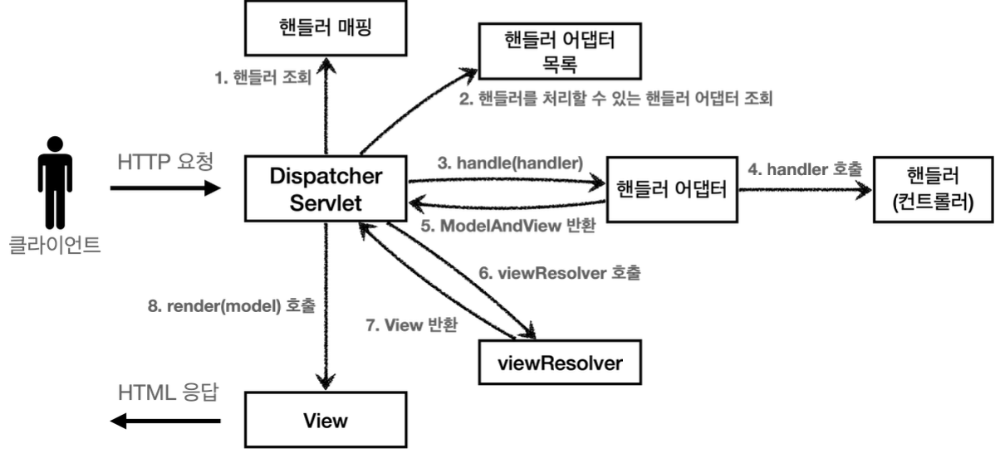

## 📎 `@RestController`와 `@Controller`의 차이점

🧠 며칠 전에 배워놓고도 내 입으로 직접 이야기하라고 하면 어떻게 말하면 좋을까? 라는 생각이 들어 정리


🗣️ 
`@Controller` 대신에 `@RestController` 어노테이션을 사용하면, 
해당 컨트롤러에 모두 `@ResponseBody`가 적용되는 효과가 있다. 
따라서 뷰 템플릿을 사용하는 것이 아니라, HTTP 메시지 바디에 직접 데이터를 입력한다.(이게 `@ResponseBody`의 기능) 

이름 그대로 Rest API(HTTP API)를 만들 때 사용하는 컨트롤러이다.

`@ResponseBody` 는 클래스 레벨에 두면 전체 메서드에 적용되는데,

`@Controller` + `@ResponseBody` = `@RestController` 라고 생각하면 된다.

`@RestController` 어노테이션 안을 살펴보면 `@ResponseBody` 가 적용되어 있다.


## 📎 Mapping Requests - consumes, produces

업무 중 코드를 보다가 컨트롤러에서 `consumes` 속성을 발견했는데 spring mvc 1편을 공부할 때도 나왔던 부분이라, [spring 공식 문서](https://docs.spring.io/spring-framework/reference/web/webmvc/mvc-controller/ann-requestmapping.html#mvc-ann-requestmapping-consumes)를 통해 해당 내용을 한번 정리해보고자 한다.

### Consumable Media Types

요청을 매핑할 때 `Content-Type` 을 기준으로 요청을 더욱 한정할 수 있다.

```java
@PostMapping(path = "/pets", consumes = "application/json") // (1)
public void addPet(@RequestBody Pet pet) {
	// ...
}
```

(1) 이렇게 Mapping 어노테이션에 `consumes` 속성을 작성하면 Content-Type 을 Json으로 좁힐 수 있다.

`consumes` 속성은 반대로도 사용할 수 있다. `!text/plain` 이런 식으로 작성하면 `text/plain` 속성을 제외하고 나머지만 지원한다.

클래스 레벨에도 `consumes` 속성을 정의할 수 있다.

클래스 레벨에서 `consumes` 속성을 정의한 후, 메서드 레벨에서`consumes` 속성을 다시 정의하면, 메서드 레벨에서 사용한 게 클래스 레벨을 덮어쓴다.

`MediaType`은 자주 쓰이는 타입을 상수로 제공한다.

ex) `APPLICATION_JSON_VALUE`, `APPLICATION_XML_VALUE` 등

### Producible Media Types

1. `produces`는 반환하는 데이터 타입을 정의한다.

    ```java
    @GetMapping(path = "/pets/{petId}", produces = "application/json") // (1)
    @ResponseBody
    public Pet getPet(@PathVariable String petId) {
    	// ...
    }
    ```

   (1) 이 경우에는 반환 타입이 json으로 강제된다.

2. `Accept` 요청 헤더에 대해서도 한정할 수 있다.

   서버로 요청하는 입장에서 Json 타입의 데이터를 원한다면 헤더에 아래와 같이 추가해서 요청한다

    ```bash
    Accept:application/json
    ```


클래스 레벨에도 `produces`속성을 정의할 수 있다.

클래스 레벨에서 `produces`속성을 정의한 후, 메서드 레벨에서`produces`속성을 다시 정의하면, 메서드 레벨에서 사용한 게 클래스 레벨을 덮어쓴다.

### References

[스프링 공식 문서](https://docs.spring.io/spring-framework/reference/web/webmvc/mvc-controller/ann-requestmapping.html#mvc-ann-requestmapping-consumes)

[블로그](https://mungto.tistory.com/438)

## SpringMVC 구조



1. 요청 URL을 처리할 수 있는 핸들러를 조회하기 위해 먼저 핸들러 매핑을 통해 조회한다.
2. 그 다음 해당 핸들러를 처리할 수 있는 핸들러 어댑터를 조회한다.
3. 핸들러 어댑터를 리턴받았다면 그 핸들러 어댑터를 통해 핸들러를 호출하고, 요청에 응답하는 정보가 담겨있는 Model과 View 정보를 리턴받는다.
4. View Resolver를 호출해서 View를 반환 받고 render를 호출한 뒤
5. HTML로 응답한다.
