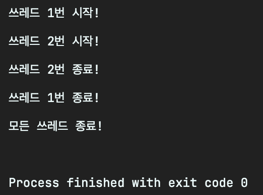
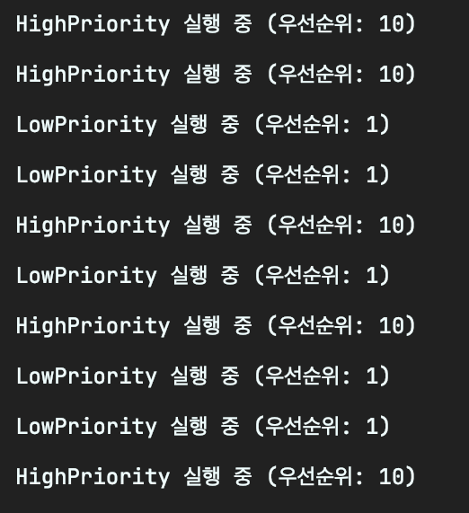
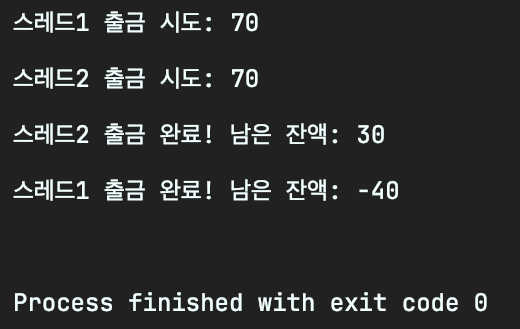
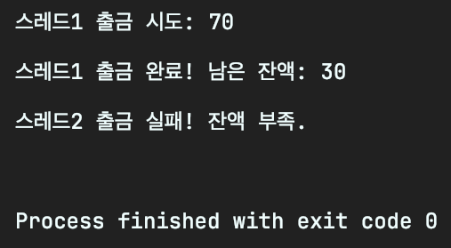
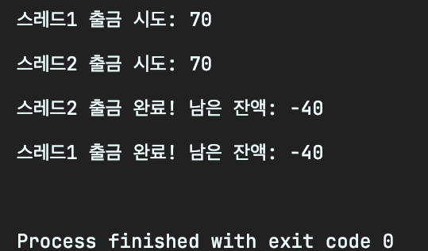
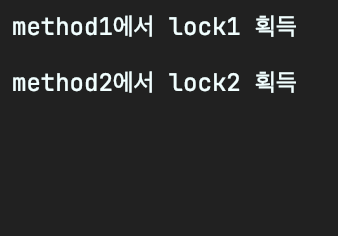
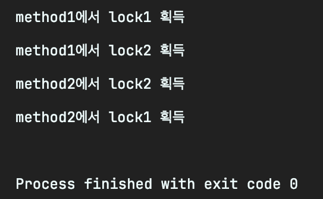
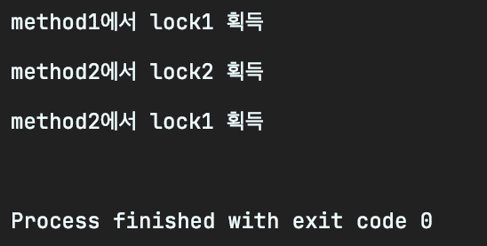
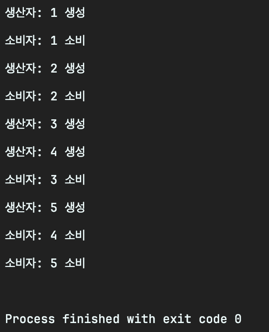

# 🤖 프로세스 & 쓰레드

## 공부하는 이유

프로세스와 쓰레드는 컴퓨터의 기본 동작을 이해하는 데에 매우 중요함.

멀티태스킹을 비롯해서 현대 운영체제를 핵심 개념이기 때문에 다른 개념을 학습하는 데에도  도움이 됨.

## 공부할 내용

- 프로세스, 쓰레드, 멀티쓰레드, 프로세스와 쓰레드의 차이점
- **Context Switching, Concurrency, Parallelism**
- 멀티 쓰레드 환경에서 발생할 수 있는 문제점

이런 부분을 공부하면 CPU Scheduling을 할 때와 동기화 개념을 배울 때 유리하다.

## 프로세스

- **운영체제(OS)로부터** 자원을 할당받아 독립적으로 실행되는 단위
- CPU, 메모리, 파일 핸들 등을 포함하고 있어서 **다른 프로세스와 자원을 공유하지 않음**

예제:

- 게임, 음악 플레이어, 웹 브라우저, 코드 편집기 등 각 애플리케이션이 하나의 독립된 프로세스
- 서로 독립적으로 실행되며, 한 프로세스가 종료되어도 다른 프로세스에 영향을 주지 않음

### 프로세스 예제 코드

```java
import java.io.IOException;

public class ProcessExample {
    public static void main(String[] args) {
        try {
            // macOS 에서 텍스트 편집기 실행
            Process notepad = new ProcessBuilder("open", "-a", "TextEdit").start();
            // macOS 에서 계산기 실행
            Process calc = new ProcessBuilder("open", "-a", "Calculator").start();

            System.out.println("두 개의 프로세스 실행 완료!");
        } catch (IOException e) {
            e.printStackTrace();
        }
    }
}
```

✔️ 실행된 프로세스들은 각각 독립적인 메모리 공간을 가짐

✔️ 한 프로세스가 종료되어도 다른 프로세스에 영향을 주지 않음

## 쓰레드

- 프로세스 내부에서 실행되는 **작업** 단위
- 하나의 프로세스 안에 여러 쓰레드가 존재할 수 있고, **같은 프로세스의 자원을 공유**함

예제:

- 웹 브라우저에서 여러 개의 탭이 각각 쓰레드로 동작할 수 있다.
  - 일부 브라우저에서는 각 탭을 별도의 프로세스로 관리하는 경우도 있다.
- 게임에서는 렌더링, 사운드 처리, 네트워크 통신을 각각 다른 쓰레드가 수행할 수 있다.

### 쓰레드 예제 코드

```java
class MyThread extends Thread {
    private String name;

    public MyThread(String name) {
        this.name = name;
    }

    @Override
    public void run() {
        System.out.println("쓰레드 " + name + " 시작!");
        try {
            Thread.sleep(2000);
        } catch (InterruptedException e) {
            e.printStackTrace();
        }
        System.out.println("쓰레드 " + name + " 종료!");
    }
}

public class ThreadExample {
    public static void main(String[] args) {
        MyThread t1 = new MyThread("1번");
        MyThread t2 = new MyThread("2번");

        t1.start();
        t2.start();

        try {
            t1.join();;
            t2.join();
        } catch (InterruptedException e) {
            e.printStackTrace();
        }

        System.out.println("모든 쓰레드 종료!");
    }
}
```



✔️ 두 개의 쓰레드가 동시에 실행됨

✔️ 쓰레드는 같은 프로세스의 메모리를 공유하면서 실행됨

## 컨텍스트 스위칭

컨텍스트 스위칭은 운영체제가 여러 프로세스나 쓰레드가 CPU를 번갈아 사용하게 할 때 발생하는 비용을 의미

- 이 비용은 **CPU 상태를 저장하고 복원하는 작업**으로, 여러 프로세스나 쓰레드를 처리하는 동안 **컨텍스트 스위칭이 발생**한다면 그때마다 성능 저하가 있을 수 있어
- 이 과정에서 **프로세스나 쓰레드의 레지스터 상태, 메모리 상태**를 저장하고 복원하는 시간이 소모되는 거지.
- 그래서 컨텍스트 스위칭의 빈도가 많을수록 **성능에 부정적인 영향을 미칠 수 있어**

## 쓰레드 풀 (Thread Pool)

쓰레드 풀은 여러개의 쓰레드를 **미리 만들어**두고, 필요할 때마다 **새로운 스레드를 만들지 않고, 기존 스레드를 재사용**하는 방식이야.

- [리소스 절약] 쓰레드 풀을 사용하면 매번 쓰레드를 만들고 종료하는 비용을 줄일 수 있어!
- [효율적인 쓰레드 관리] 필요할 때마다 작업을 분배해서 쓰레드를 효율적으로 사용할 수 있어.
- [컨텍스트 스위칭 최소화] 자주 스위칭되는 쓰레드 수가 제한되므로 불필요한 컨텍스트 스위칭을 줄일 수 있어.
- `ExecutorService`를 사용하면 자원을 미리 할당하고 효율적으로 관리할 수 있어

```java
import java.util.concurrent.ExecutorService;
import java.util.concurrent.Executors;
import java.util.concurrent.TimeUnit;

public class ThreadPoolExample {
    public static void main(String[] args) throws InterruptedException {
        // 스레드 풀 생성: 3개의 스레드만 실행 가능
        ExecutorService executorService = Executors.newFixedThreadPool(3);

        // 여러 작업을 제출
        for (int i = 0; i < 10; i++) {
            final int taskId = i;
            executorService.submit(() -> {
                try {
                    System.out.println("작업 " + taskId + " 시작! - " + Thread.currentThread().getName());
                    Thread.sleep(1000); // 1초 동안 작업 대기
                    System.out.println("작업 " + taskId + " 종료! - " + Thread.currentThread().getName());
                } catch (InterruptedException e) {
                    e.printStackTrace();
                }
            });
        }

        // 모든 작업이 끝날 때까지 기다리기
        executorService.shutdown();
        executorService.awaitTermination(1, TimeUnit.MINUTES);

        System.out.println("모든 작업 종료!");
    }
}
```

✔️ `Executors.newFixedThreadPool(3)` → 3개의 스레드만 유지

✔️ `execute()`를 사용하면 새로운 스레드를 매번 만들지 않고, 기존 스레드를 재사용

✔️ `shutdown()` 을 호출하면 모든 작업이 끝난 후 스레드 풀 종료

✔️ `awaitTermination()`을 사용하면 모든 작업이 끝낼때까지 기다려

### 🔥 실습 포인트

- 스레드 풀에서 동시에 실행되는 스레드 수는 3개로 제한되고, 그 외의 작업은 대기 상태로 큐에 쌓여.
- 스레드 풀 내에서 한 번에 실행되는 스레드 수가 정해져 있기 때문에 컨텍스트 스위칭이 일어나지 않도록 최적화할 수 있어

## 컨텍스트 스위칭 최적화

컨텍스트 스위칭은 계속 이야기하지만 **CPU가 현재 실행 중인 쓰레드의 상태를 저장하고 새로운 쓰레드의 상태를 복원**하는 과정이야.

물론 이 과정을 피할 수는 없어! 그치만 **너무 자주 발생하면 성능 저하**가 일어나니까 **최적화하는 방법**이 중요해

### 최적화 방법

1. **스레드 풀 크기 최적화**
  - `newFixedThreadPool(n)`에서 `n`값을 적절하게 설정하는 것이 중요해
  - 너무 많으면? → 컨텍스트 스위칭 비용이 증가해
  - 너무 적으면? → CPU 활용도가 낮아져 작업이 지연돼.

📌 **최적의 스레드 개수는?**

CPU 코어 수(`N`)에 따라 결정할 수 있어:

1. **CPU 작업 위주(=계산 중심):**
  - CPU를 많이 사용하는 작업이라면 **코어 개수에 맞게** 스레드 풀을 설정하는 게 좋아
  - 스레드 개수 = `N + 1`
2. **I/O 작업 위주(= 파일, DB, 네트워크 작업):**
  - I/O 작업은 CPU보다 **대기 시간이 많기 때문에** 더 많은 스레드를 사용할 수 있어
  - 스레드 개수 = `2N` 또는 `2N + 1`

🛠 **실습 코드: 스레드 풀 크기 조절**

```java
import java.util.concurrent.ExecutorService;
import java.util.concurrent.Executors;

public class ThreadPoolOptimization {
    public static void main(String[] args) {
        int coreCount = Runtime.getRuntime().availableProcessors();
        System.out.println("CPU 코어 개수: " + coreCount);

        // CPU 작업 위주라면 coreCount + 1, I/O 작업 위주라면 coreCount * 2
        ExecutorService executorService = Executors.newFixedThreadPool(coreCount + 1);

        for (int i = 0; i < 10; i++) {
            final int taskId = i;
            executorService.execute(() -> {
                System.out.println("작업 " + taskId + " 실행 중! - " + Thread.currentThread().getName());
                try {
                    Thread.sleep(1000); // 1초 동안 작업 대기
                } catch (InterruptedException e) {
                    e.printStackTrace();
                }
            });
        }

        executorService.shutdown();
    }
}
```

1. **작업 큐 크기 조정**
  - 스레드 풀이 **처리할 수 있는 작업보다 더 많은 작업**이 들어오면 큐에서 대기하게 돼
  - 너무 많은 작업이 대기하게 되면? **메모리 부족**(`OutOfMemoryError`)이 발생할 수도 있어.
  - 따라서 **적절한 큐 크기**를 설정해야해

🛠 **실습 코드: 작업 큐 크기 설정**

```java
import java.util.concurrent.*;

public class ThreadPoolQueueOptimization {
    public static void main(String[] args) {
        int coreCount = Runtime.getRuntime().availableProcessors();

        // 최대 5개의 작업만 대기할 수 있는 큐
        BlockingQueue<Runnable> queue = new ArrayBlockingQueue<>(5);

        ThreadPoolExecutor executor = new ThreadPoolExecutor(
                coreCount, coreCount * 2, 1, TimeUnit.SECONDS, queue
        );

        for (int i = 0; i < 20; i++) { // 15개의 작업 추가
            final int taskId = i;
            try {
                executor.submit(() -> {
                    System.out.println("작업 " + taskId + " 실행 중! - " + Thread.currentThread().getName());
                });
                try {
                    Thread.sleep(2000); // 1초 동안 작업 대기
                } catch (InterruptedException e) {
                    e.printStackTrace();
                }
            } catch (RejectedExecutionException e) {
                System.out.println("작업 " + taskId + "이(가) 큐가 가득 차서 거부됨!");
            }
        }

        executor.shutdown();
    }
}
```

✔️ 결과를 보면 큐가 가득 차서 거부된다는 데 잘 실행됨.. 모지?

1. **스레드 우선순위 조정**
  - 중요한 작업을 우선 실행하려면 `Thread.setPriority(int)`를 사용할 수 있어
  - **우선순위가 높은 스레드는 더 자주 실행**될 가능성이 커.

 🛠 **실습 코드: 스레드 우선순위 조정**

  ```java
  class PriorityThread extends Thread {
      private int priority;
  
      public PriorityThread(String name, int priority) {
          super(name);
          this.priority = priority;
      }
  
      @Override
      public void run() {
          Thread.currentThread().setPriority(priority);
          for (int i = 0; i < 5; i++) {
              System.out.println(getName() + " 실행 중 (우선순위: " + getPriority() + ")");
          }
      }
  }
  
  public class ThreadPriorityExample {
      public static void main(String[] args) {
          PriorityThread t1 = new PriorityThread("LowPriority", Thread.MIN_PRIORITY);
          PriorityThread t2 = new PriorityThread("HighPriority", Thread.MAX_PRIORITY);
  
          t1.start();
          t2.start();
      }
  }
  ```

 ✔️ 실행해보면 우선순위가 높은 스레드가 더 자주 실행된다고 하는데,

 ✔️ 운영체제마다 다를 수 있기 때문에 절대적인 것은 아니라고 해 → 실제로 아님 5번 중에 5번 모두 반반 실행됨

 

1. **컨텍스트 스위칭을 줄이는 락(lock) 최소화**
  - `synchronized`  블록을 많이 쓰면 **스레드가 대기하는 시간이 증가**
  - `ReentrantLock`, `ReadWriteLock` , `Concurrent Collections` 활용
  - 그래서 가능하면 **락을 줄이고 비동기적으로 처리하는 방식**을 고려해야해 + 각 스레드가 독립적으로 동작하도록 설계

### ✅ **정리: 컨텍스트 스위칭 최적화 방법**

| 방법 | 설명 |
| --- | --- |
| 스레드 풀 크기 최적화 | CPU 코어 수에 맞게 적절한 스레드 개수 설정 |
| 작업 큐 그기 조정 | 너무 많은 작업이 대기하지 않도록 큐 크기 설정 |
| 스레드 우선순위 조정 | 중요한 작업을 우선적으로 실행 |
| 락(lock) 최소화 | `synchronized` 대신 `ConcurrentHashMap` 같은 동시성 클래스 사용 |

## 멀티쓰레드 환경에서 데이터 충돌 문제 해결 (동기화와 데드락 방지)

### 데이터 충돌이란?

멀티쓰레드 환경에서 **여러 스레드가 동시에 같은 데이터(공유 자원)에 접근**하면 문제가 발생할 수 있어.

예를 들어 은행 계좌에서 여러 스레드가 동시에 출금 요청을 하면 잔액보다 많은 금액이 인출되는 문제가 생길 수도 있어

🛠 **실습 코드: 동기화(Synchronized) 적용 전**

```java
public class SynchronizedExample {
    public static void main(String[] args) {
        BankAccount account = new BankAccount();

        Thread t1 = new Thread(() -> account.withdraw("스레드1", 70));
        Thread t2 = new Thread(() -> account.withdraw("스레드2", 70));

        t1.start();
        t2.start();
    }
}

class BankAccount {
    private int balance = 100;

    public void withdraw(String name, int amount) {
        if (balance >= amount) {
            System.out.println(name + " 출금 시도: " + amount);
            try {
                Thread.sleep(100);
            } catch (InterruptedException e) {
                e.printStackTrace();
            }
            balance -= amount;
            System.out.println(name + " 출금 완료! 남은 잔액: " + balance);
        } else {
            System.out.println(name + " 출금 실패! 잔액 부족.");
        }
    }
}
```

✔️ **출력 결과 (데이터 충돌 발생 가능)**



❌ **두 스레드가 동시에 조건을 통과하면서 잔액이 음수가 됨!**

### 해결 방법 1: Synchronized 블록 사용하기

`synchronized` 키워드를 사용하면 **동시에 하나의 스레드만 공유 자원에 접근**할 수 있도록 제어할 수 있어

🛠 **실습 코드: 동기화(Synchronized) 적용 후+ 실습 코드: synchronized 블록 적용**

```java
class BankAccount {
    private int balance = 100;

    public synchronized void withdraw(String name, int amount) {
        if (balance >= amount) {
            System.out.println(name + " 출금 시도: " + amount);
            try {
                Thread.sleep(100);
            } catch (InterruptedException e) {
                e.printStackTrace();
            }
            balance -= amount;
            System.out.println(name + " 출금 완료! 남은 잔액: " + balance);
        } else {
            System.out.println(name + " 출금 실패! 잔액 부족.");
        }
    }
}
```



✔️ `synchonized` 덕분에 한 번에 한 스레드만 출금할 수 있어 데이터 충돌이 해결됨!

✔️ `synchronized` 를 사용하면 여러 스레드가 동시에 접근하지 못하고 **순차적으로 실행**

✔️ 데이터 일관성을 유지(목적 달성)하지만, **성능 저하가 발생**(사이드 이펙트 발생)할 수 있다

✔️ 단순하지만 유연성이 부족 → `ReentrantLock`을 사용하면 **더 세밀한 제어 가능**

### 해결 방법 2: `ReentrantLock` 사용하기

`ReentrantLock`은 `synchronized`보다 **더 유연한 락**을 제공해.

🛠 **실습 코드: ReentrantLock 적용**

```java
class BankAccount {
    private int balance = 100;
    private ReentrantLock lock = new ReentrantLock(); // 락 선언

    public synchronized void withdraw(String name, int amount) {
        lock.lock();
        try {
            if (balance >= amount) {
                System.out.println(name + " 출금 시도: " + amount);
                try {
                    Thread.sleep(100);
                } catch (InterruptedException e) {
                    e.printStackTrace();
                }
                balance -= amount;
                System.out.println(name + " 출금 완료! 남은 잔액: " + balance);
            } else {
                System.out.println(name + " 출금 실패! 잔액 부족.");
            }
        } finally {
            lock.unlock(); // 반드시 락 해제
        }
    }
}
```

✔️ synchronized와 동일하게 데이터 충돌이 해결됨!

✔️ `ReentrantLock` 을 사용하면 락을 세밀하게 조절 가능

✔️ `try-finally` 를 사용해서 예외가 발생해도 락을 반드시 해제해야 함.

### 해결 방법 3: `AtomicInteger`사용하기

`AtomicInteger`는 동기화 없이도 **원자적(atomic) 연산**을 지원해서 성능이 더 좋을 수 있어

🛠 **실습 코드: AtomicInteger 적용**

```java
class BankAccount {
    private AtomicInteger balance = new AtomicInteger(100);

    public void withdraw(String name, int amount) {
        if (balance.get() >= amount) {
            System.out.println(name + " 출금 시도: " + amount);
            try {
                Thread.sleep(100);
            } catch (InterruptedException e) {
                e.printStackTrace();
            }
            balance.addAndGet(-amount);
            System.out.println(name + " 출금 완료! 남은 잔액: " + balance);
        } else {
            System.out.println(name + " 출금 실패! 잔액 부족.");
        }
    }
}
```



✔️ 엥? 안되는데?

## 데드락 방지

### 데드락(DeadLock) 이란?

**💀 두 개 이상의 스레드가 서로가 가진 자원을 기다리면서 무한 대기 상태에 빠지는 현상 💀**

🛠 **실습 코드: 데드락 발생 예제**

```java
import java.util.concurrent.locks.ReentrantLock;

public class DeadlockExample {
    public static void main(String[] args) {
        SharedResource resource = new SharedResource();

        Thread t1 = new Thread(() -> resource.method1());
        Thread t2 = new Thread(() -> resource.method2());

        t1.start();
        t2.start();
    }
}

class SharedResource {
    private ReentrantLock lock1 = new ReentrantLock();
    private ReentrantLock lock2 = new ReentrantLock();

    public void method1() {
        lock1.lock();
        System.out.println("method1에서 lock1 획득");
        try {
            Thread.sleep(100);
        } catch (InterruptedException e) {
            e.printStackTrace();
        }

        lock2.lock();
        System.out.println("method1에서 lock2 획득");
        lock2.unlock();
        lock1.unlock();
    }

    public void method2() {
        lock2.lock();
        System.out.println("method2에서 lock2 획득");
        try {
            Thread.sleep(100);
        } catch (InterruptedException e) {
            e.printStackTrace();
        }

        lock1.lock();
        System.out.println("method2에서 lock1 획득");
        lock1.unlock();
        lock2.unlock();
    }
}
```



✔️ `method1`은 `lock1`을 먼저 잡고 `lock2`를 기다림

✔️ `method2`는 `lock2`를 먼저 잡고 `lock1`을 기다림

❌ 두 스레드가 서로의 락을 기다리면서 영원히 멈춘다.

### 해결 방법 1: 락 획득 순서 지정(Lock Ordering)

**🛠 실습 코드: 락 획득 순서 고정**

```java
import java.util.concurrent.locks.ReentrantLock;

public class DeadlockExample {
    public static void main(String[] args) {
        SharedResource resource = new SharedResource();

        Thread t1 = new Thread(() -> resource.method1());
        Thread t2 = new Thread(() -> resource.method2());

        t1.start();
        t2.start();
    }
}

class SharedResource {
    private ReentrantLock lock1 = new ReentrantLock();
    private ReentrantLock lock2 = new ReentrantLock();

    public void method1() {
        lock1.lock();
        System.out.println("method1에서 lock1 획득");
        try {
            Thread.sleep(100);
        } catch (InterruptedException e) {
            e.printStackTrace();
        }

        lock2.lock();
        System.out.println("method1에서 lock2 획득");
        lock2.unlock();
        lock1.unlock();
    }

    public void method2() {
        lock1.lock();
        System.out.println("method2에서 lock2 획득");
        try {
            Thread.sleep(100);
        } catch (InterruptedException e) {
            e.printStackTrace();
        }

        lock2.lock();
        System.out.println("method2에서 lock1 획득");
        lock2.unlock();
        lock1.unlock();
    }
}
```



✔️ `method1` 과 `method2` 가 항상 `lock1`→ `lock2` 순서로 락을 획득

✔️ 두 스레드가 같은 순서로 접근하면 데드락이 발생하지 않음

### 해결 방법 2: 타임아웃 설정(`tryLock` 사용)

**🛠 실습 코드: `tryLock()` 사용**

```java
import java.util.concurrent.TimeUnit;
import java.util.concurrent.locks.ReentrantLock;

public class DeadlockExample {
    public static void main(String[] args) {
        SharedResource resource = new SharedResource();

        Thread t1 = new Thread(() -> resource.method1());
        Thread t2 = new Thread(() -> resource.method2());

        t1.start();
        t2.start();
    }
}

class SharedResource {
    private ReentrantLock lock1 = new ReentrantLock();
    private ReentrantLock lock2 = new ReentrantLock();

    public void method1() {
        try {
            if (lock1.tryLock(3, TimeUnit.SECONDS)) {
                System.out.println("method1에서 lock1 획득");

                if (lock2.tryLock(3, TimeUnit.SECONDS)) {
                    System.out.println("method1에서 lock2 획득");
                    lock2.unlock();
                }
                lock1.unlock();
            }
        } catch (InterruptedException e) {
            e.printStackTrace();
        }
    }

    public void method2() {
        try {
            if (lock2.tryLock(3, TimeUnit.SECONDS)) {
                System.out.println("method2에서 lock2 획득");

                if (lock1.tryLock(3, TimeUnit.SECONDS)) {
                    System.out.println("method2에서 lock1 획득");
                    lock1.unlock();
                }
                lock2.unlock();
            }
        } catch (InterruptedException e) {
            e.printStackTrace();
        }
    }
}
```



✔️ `tryLock(3, TimeUnit.SECONDS)`을 사용하면 **3s 동안 락을 기다린 후 실패하면 포기**

→ method1에서 lock2를 획득하지 못하고 포기한 걸 볼 수 있음

✔️ 데드락에 빠지지 않고, 다른 작업을 수행할 수 있음!

### 해결 방법 3: 교착 상태 탐지(DeadLock Detection)

- 운영체제처럼 데드락을 감지하고 해제하는 방법도 있지만
- 일반적인 애플리케이션에서는 **보통 락 순서를 고정하거나 `tryLock()`을 활용하는 게 효율적이야.**

## 생산자-소비자 패턴(Producer-Consumer Pattern)

멀티스레드 환경에서는 공유 자원을 여러 스레드가 사용하고자 할 때 **경쟁 상태(race condition)가 발생**할 수 있어.

그래서 이를 방지하면서 효율적으로 작업을 처리하는 대표적인 패턴이 생산자-소비자 패턴이야.

### 생산자-소비자 패턴이란?

- **생산자(Producer)**: 데이터를 생성해서 공유 큐에 추가하는 역할
- **소비자(Consumer**): 공유 큐에서 데이터를 가져와 처리하는 역할
- **공유 큐(Buffer)**: 데이터를 주고받는 공간
- **Blocking queue 사용**: 자동으로 동기화를 처리하며 데드락을 방지

### `BlockingQueue` 를 활용한 생산자-소비자 패턴 구현

- 왜 `BlockingQueue`를 사용하는가?
  1. 동기화 문제
    - 생산자가 데이터를 넣는 도중에 소비자가 동시에 데이터를 꺼내려고 할 때 동기화가 필요해
    - 일반적인 `Queue`를 사용할 경우에는, `synchronized`나 `wait-notify` 같은 메커니즘을 직접 구현해야해

     ⇒ `BlockingQueue` 가 스레드-세이프하기 때문에 동기화 문제를 해결할 수 있어.

  2. Budy Waiting 문제
    - 소비자가 데이터가 없을 때 계속해서 CPU 자원을 낭비하며 대기할 수 있어.
    - `while`문을 돌면서 큐가 비었는지 `while(queue.isEmpty)) {}`는 비효율적이잖아.

     ⇒ 큐가 가득차면 생산자가 `put()`할 때 자동으로 대기하게 하고, 큐가 비어있으면 소비자가 `take()`할 때 자동으로 대기하게 해. 그래서 Busy Waiting을 하지 않아도 돼

  3. 오버플로우 & 언더플로우 문제
    - 생산자가 너무 많은 데이터를 넣으면 큐가 넘칠 수 있고, 소비자가 데이터를 너무 빠르게 꺼내면 큐가 빌 수 있어.

     ⇒ 크기를 제한한 큐를 설정할 수 있어서 메모리 오버플로우 문제를 방지할 수 있어


🛠 실습 코드: Producer & Consumer

```java
import java.util.concurrent.ArrayBlockingQueue;
import java.util.concurrent.BlockingQueue;

public class BlockingQueueExample {
    public static void main(String[] args) {
        BlockingQueue<Integer> queue = new ArrayBlockingQueue<>(2);

        Thread producer = new Thread(new Producer(queue));
        Thread consumer = new Thread(new Consumer(queue));

        producer.start();
        consumer.start();
    }
}

class Producer implements Runnable {
    private BlockingQueue<Integer> queue;

    public Producer(BlockingQueue<Integer> queue) {
        this.queue = queue;
    }

    @Override
    public void run() {
        try {
            for (int i = 1; i <= 5; i++) {
                queue.put(i); // 큐가 꽉 차면 자동으로 대기(Blocking)
                System.out.println("생산자: " + i + " 생성");
                Thread.sleep(1000);
            }
        } catch (InterruptedException e) {
            Thread.currentThread().interrupt();
        }
    }
}

class Consumer implements Runnable {
    private BlockingQueue<Integer> queue;

    public Consumer(BlockingQueue<Integer> queue) {
        this.queue = queue;
    }

    @Override
    public void run() {
        try {
            for (int i = 1; i <= 5; i++) {
                Integer data = queue.take(); // 큐가 비어있으면 자동으로 대기(Blocking)
                System.out.println("소비자: " + data + " 소비");
                Thread.sleep(2000);
            }
        } catch (InterruptedException e) {
            Thread.currentThread().interrupt();
        }
    }
}
```



### 코드 설명

✅ `BlockingQueue<Integer>`: 자동으로 동기화되는 큐

✅ `queue.put(data)`: 큐에 데이터를 추가 (생산자)

✅ `queue.take()`: 큐에서 데이터를 꺼내 처리 (소비자)

✅ `Thread.sleep()`: 실행 속도를 조절하여 동작 확인

### 생산자-소비자 패턴의 장점

✅ **동기화 자동 처리** (`BlockingQueue` 사용)

✅ **데드락 방지** (큐 크기 제한으로 과부하 방지)

✅ **생산자-소비자 간의 처리 속도 조절 가능**

### 다음

[2. CPU 스케줄링](https://www.notion.so/2-CPU-1a01a4ff0ac080748b51d46936c4fb66?pvs=21)